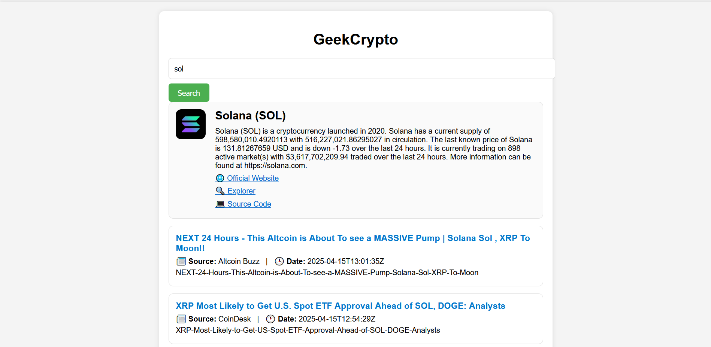

# 📰 GeekCrypto – Cryptocurrency News Aggregator

**GeekCrypto** is a Rust-based web service that aggregates the latest cryptocurrency news and metadata from two external APIs: **CryptoPanic** and **CoinMarketCap**. Users can search by cryptocurrency symbol (e.g., BTC, ETH, SOL) and get:
- A quick summary of the coin (name, logo, description, website)
- A list of recent news articles from multiple sources

## Features
- Fetches and displays metadata of requested coin using CoinMarketCap API
- Aggregates latest related news for requested coin using CryptoPanic API
- Basic frontend with input field and styled display for data
- In-memory caching to reduce redundant API calls
- Graceful error handling for invalid queries and API issues

---

## Tech Stack
- **Backend:** Rust + Warp web framework
- **Frontend:** HTML, CSS, JavaScript (vanilla)
- **Data Sources:**
  - [CryptoPanic API](https://cryptopanic.com/developers/api/)
  - [CoinMarketCap API](https://coinmarketcap.com/api/)
- **Caching:** DashMap in-memory TTL cache

---

## Installation

### 1. Clone the repo

```bash
git clone https://github.com/your-username/crypto-news-aggregator.git
cd crypto-news-aggregator
```

### 2. Set environment variables

Rename `.env.example to .env` file:

```
CRYPTOPANIC_API_KEY=your_cryptopanic_api_key
COINMARKETCAP_API_KEY=your_coinmarketcap_api_key
```
## GET THE KEYS ON OFFICIAL API SOURCES


> Do not commit this `.env` file. Use `.env.example` as a public template.

### 3. Build & Run

```bash
cargo build
cargo run
```

The app will be available at: [http://localhost:8080/index.html](http://localhost:8080/index.html)

---


## Screenshots

---

## License

This project is open-source and available under the [MIT License](LICENSE).
